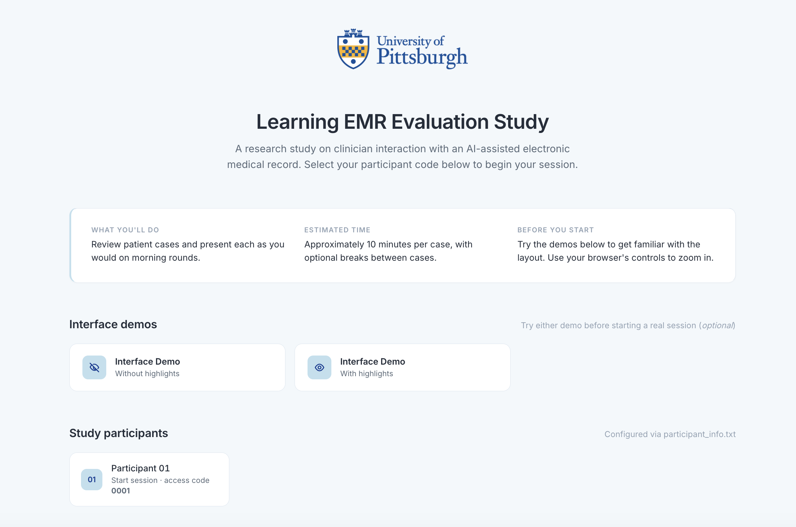

# Learning EMR — Automation-Bias Study Fork

A Django prototype of a Learning Electronic Medical Record (LEMR) system, adapted from
Andrew J. King's original [`LEMRinterface`](https://github.com/ajk77/LEMRinterface) and
extended with the study-specific machinery required for the automation-bias evaluation
reported in Luca Calzoni's 2026 PhD dissertation at the University of Pittsburgh.

The interface displays temporal patient data (labs, vitals, medications, ventilator
settings, I/O, notes) and highlights items that a machine-learning model predicts a
clinician will seek. This fork instruments the interface for a within-participant
experiment with three highlighting-reliability conditions (no highlights, correct-only,
correct + planted decoys) and records timing, item selections, McKnight trust ratings,
commission and omission errors, and per-error rationales.



## Lineage and attribution

- **Upstream:** Andrew J. King, `LEMRinterface`, GPL-3.0, University of Pittsburgh, 2018.
  <https://github.com/ajk77/LEMRinterface>
- **This fork:** Luca Calzoni, 2026, GPL-3.0-or-later, study-specific modifications.

King's original interface is the source lineage of every core UI convention here —
the temporal chart display, the highlighting idiom, the case-data pipeline. This fork
retains those foundations, ports the codebase from Python 2 to Python 3, and adds the
study-specific measurement machinery. A full change log is in
[CHANGES_FROM_KING.md](CHANGES_FROM_KING.md).

## What this repository does and does not contain

**Contains:** the Django prototype (interface, templates, views), the participant-file
generator, the deterministic error classifier, the CSV export path, and a small
synthetic case set for demonstration.

**Does not contain:** any protected patient data. The pickled case files that drove
the actual study cannot be redistributed. The `resources/demo_study/` folder in the
upstream King repo provides three synthetic cases derived from scrambled safe-harbor
data; see [CASE_FORMAT.md](docs/CASE_FORMAT.md) for how to bring your own cases.

## Quick start

```bash
# Requires: Python 3.9, Django 1.11
git clone https://github.com/<your-user>/LEMR.git
cd LEMR/EvaluationStudy
python3.9 -m venv .venv
source .venv/bin/activate
pip install -r ../requirements.txt
python manage.py migrate
python manage.py runserver 0.0.0.0:8000
# open http://127.0.0.1:8000/WebEmrGui/
```

Full install and deployment instructions are in [docs/SETUP.md](docs/SETUP.md).
A Docker Compose recipe (no local Python needed) is in [`docker-compose.yml`](docker-compose.yml).

## Screenshots

| Home | Case (no highlights) | Case (with highlights) | Relevant Data Selection Screen | Commission Rationale Prompt | Omission Rationale Prompt | Admin Report |
|:---:|:---:|:---:|:---:|:---:|:---:|:---:|
|  |  |  |  |  |  |  |

| Home | Case (no highlights) | Case (with highlights) | Relevant Data Selection Screen | Commission Rationale Prompt | Omission Rationale Prompt | Admin Report |
|:---:|:---:|:---:|:---:|:---:|:---:|:---:|
|  |  |  |  |  |  |  |

| Home | Case (no highlights) | Case (with highlights) | Relevant Data Selection Screen | Commission Rationale Prompt | Omission Rationale Prompt | Admin Report |
|:---:|:---:|:---:|:---:|:---:|:---:|:---:|
|  |  |  |  |  |  |  |

## Documentation

- [SETUP.md](docs/SETUP.md) — environment, dependencies, first-run
- [CASE_FORMAT.md](docs/CASE_FORMAT.md) — pickled `.p` case-file schema + 9-column participant file
- [EXPORT_SCHEMA.md](docs/EXPORT_SCHEMA.md) — CSV export format for downstream analysis
- [CHANGES_FROM_KING.md](CHANGES_FROM_KING.md) — full inventory of study-specific modifications
- [CONTRIBUTING.md](CONTRIBUTING.md) — pull-request guidelines
- [RELEASE_CHECKLIST.md](RELEASE_CHECKLIST.md) — internal, for maintainers publishing new versions

## Citing this software

If you use this fork in academic work, please cite:

- Calzoni L. *Automation bias in EMR information highlighting.* PhD dissertation,
  University of Pittsburgh, 2026.
- King AJ. *The development and evaluation of a Learning Electronic Medical Record
  system.* PhD dissertation, University of Pittsburgh, 2018.

A citable Zenodo DOI for this software release will appear here once the first tag is
published.

## License

GPL-3.0-or-later, inherited from the upstream King codebase. See [LICENSE](LICENSE).
